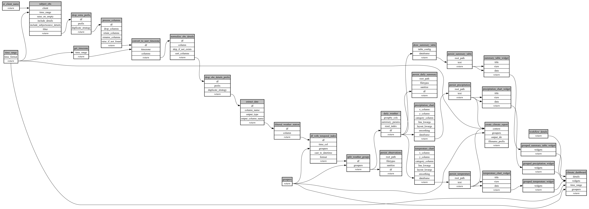

```
# AUTOGENERATED BY ECOSCOPE-WORKFLOWS; see fingerprint in README.md for details

```

```yaml
# fingerprint:
artifacts_sha256_basic: ca9ec052a7ecea2c25665b3840d07da0b951edaf12f3be5072205504511ccc66
artifacts_sha256_strict: d5a5e8ff94cf9a3a3129177b2f3deb1c82734b06d340f05ee7699a5f1886695c
installed_requirements:
- channel: https://repo.prefix.dev/ecoscope-workflows/
  name: ecoscope-workflows-core
  version: {version: ==0.22.2}
- channel: https://repo.prefix.dev/ecoscope-workflows/
  name: ecoscope-workflows-ext-ecoscope
  version: {version: ==0.22.2}
- channel: https://repo.prefix.dev/ecoscope-workflows-custom/
  name: ecoscope-workflows-ext-custom
  version: {version: ==0.0.25.dev0+ga3826bc9f.d20260210}
params_sha256: 2c00b423997e41622ce53d8a18ed941a0f484d4bf78b1f4edb957fe7144ef1f4
spec_sha256: 4e0e8bbc361ad82937fb884650ab368083bb95dc63a29f11071f3454fe9bd0bf

```

# ecoscope-workflows-climate-monitoring-workflow


