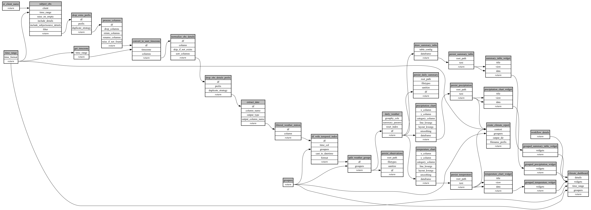

```
# AUTOGENERATED BY ECOSCOPE-WORKFLOWS; see fingerprint in README.md for details

```

```yaml
# fingerprint:
artifacts_sha256_basic: 51b50e329cee2d44d25e00dd08f712b7d887f9a95188956383e2dcd4ba58cbb9
artifacts_sha256_strict: 0ed7788db6737388939339353aa458524bd87e0119282102801cadce346818db
installed_requirements:
- channel: https://repo.prefix.dev/ecoscope-workflows/
  name: ecoscope-workflows-core
  version: {version: ==0.22.16}
- channel: https://repo.prefix.dev/ecoscope-workflows/
  name: ecoscope-workflows-ext-ecoscope
  version: {version: ==0.22.16}
- channel: https://repo.prefix.dev/ecoscope-workflows-custom/
  name: ecoscope-workflows-ext-custom
  version: {version: ==0.0.35}
params_sha256: 49bc3c8b7e835679ced69cfca65a0ad920fa8a1b5044f74c5ed952bcfc7fa837
spec_sha256: c26964c1bfd7d3621cc13bcccd567a2de19d260de2bfbde7397b50791a8baa9d

```

# ecoscope-workflows-climate-monitoring-workflow


